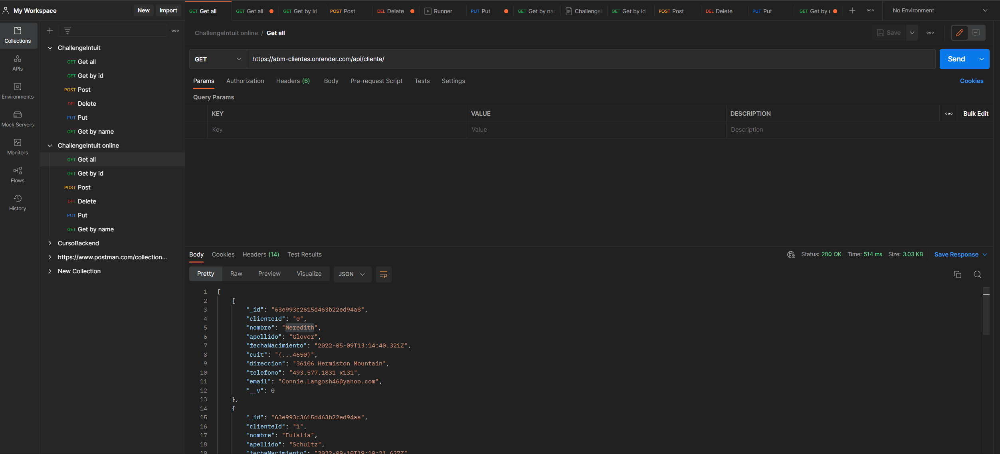

# ChallengeABMNode Intuit


Aplicacion  ABM usuarios usando patron de diseño MVC separando responsabilidades

## Instalacion

Instalar las dependencias con NPM O YARN .

```bash

npm i
```

## Crear el .env en la raiz y rellenar con los datos de su bd MongoDb

```
MONGO_URI= 
```


## Iniciar Servidor

```Javascript
npm run dev

```

## Probar  Endpoints LOCALMENTE  importando el  archivo #ChallengeIntuit.postman_collection.json en POSTMAN


## Probar  Endpoints en el link DEPLOY  importando el  archivo #ChallengeIntuit online.postman_collection en POSTMAN
deploy : https://abm-clientes.onrender.com/api/



